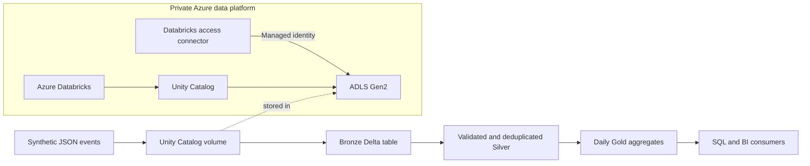
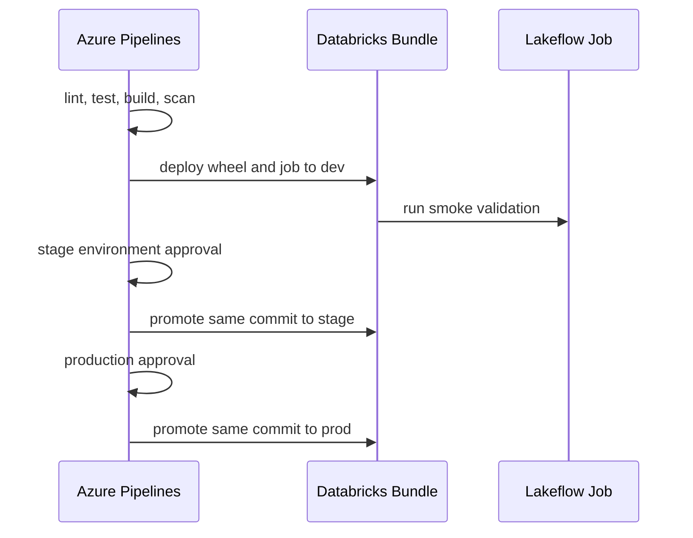

# Azure Databricks Lakehouse CI/CD

An end-to-end, production-oriented reference for provisioning an isolated Azure Databricks lakehouse and delivering a tested PySpark medallion pipeline with Terraform, Declarative Automation Bundles, Unity Catalog, and Azure DevOps workload identity federation.

> Portfolio note: all names, records, paths, and configurations are synthetic. The repository contains no commercial datasets, workspace identifiers, credentials, or code copied from another organization.

## Capabilities

| Area | Implementation |
|---|---|
| Azure infrastructure | VNet-injected Databricks workspace, no-public-IP compute, ADLS Gen2 and private endpoints |
| Governance | Unity Catalog credential, external location, catalog, schema, volume and grants |
| Data engineering | Typed ingestion, Delta MERGE, deduplication, quality gates and gold aggregates |
| Packaging | Versioned Python wheel deployed as a bundle artifact |
| Orchestration | Three-task Databricks job with dependencies, autoscaling and queueing |
| Environments | One bundle with isolated `dev`, `stage`, and `prod` targets |
| CI/CD | Azure Pipelines promotion using workload identity federation |
| Quality | PySpark tests, Ruff, mypy, Terraform validation and security scans |

## Platform architecture



## Medallion flow

| Layer | Contract | Write behavior | Quality gate |
|---|---|---|---|
| Bronze | Explicit raw event schema | Append-only Delta | Input parsing and required fields |
| Silver | Normalized typed events | Idempotent MERGE by `event_id` | Non-empty, unique and non-null key |
| Gold | Daily region/metric aggregate | Replace derived table | Deterministic grouping and metrics |



## Repository layout

| Path | Purpose |
|---|---|
| `src/lakehouse_demo` | Schemas, transformations, data-quality rules and job entry points |
| `tests` | Local Spark tests and synthetic fixtures |
| `databricks.yml` | Multi-environment bundle configuration |
| `resources` | Lakeflow job definition |
| `infra/azure` | Azure network, workspace, storage and access connector |
| `infra/databricks` | Unity Catalog and workspace-level permissions |
| `azure-pipelines.yml` | Validate and environment promotion pipeline |
| `scripts` | Strict-mode validation and deployment helpers |
| `docs/wiki` | Source-controlled GitHub Wiki pages |

## Identity model

| Identity | Responsibility | Access boundary |
|---|---|---|
| Infrastructure deployment | Provision Azure and workspace configuration | Control plane only |
| Bundle deployment | Upload artifacts and update owned jobs | Workspace deployment permissions |
| Job runtime | Read/write the workload catalog and volume | Workload data only |
| Access connector | Reach the designated ADLS account | Storage Blob Data Contributor on one account |

Azure Pipelines authenticates through a workload identity service connection. The Databricks CLI runs inside `AzureCLI@2` and reuses its short-lived Azure session; no Databricks token is stored.

## Prerequisites

- Python 3.13
- Java 17+ for local PySpark tests
- Terraform 1.10+
- Databricks CLI for live bundle validation
- An Azure DevOps ARM service connection configured with workload identity federation
- Separate Databricks deployment and runtime service principals

## Local development

```bash
python3.13 -m venv .venv
source .venv/bin/activate
python -m pip install --require-hashes -r requirements-dev.lock
./scripts/validate-ci.sh
```

The tests run Spark locally and do not contact Azure or Databricks.

## Infrastructure sequence

1. Deploy `infra/azure` into an isolated Azure subscription.
2. Establish private runner connectivity to the workspace and storage endpoints.
3. Pass the Azure stack outputs to `infra/databricks` through protected pipeline variables.
4. Apply the Unity Catalog stack using the deployment identity.
5. Upload synthetic events to the landing volume.
6. Deploy the bundle with `./scripts/deploy-bundle.sh dev`.

Real `tfvars`, state, bundle deployment metadata and credentials are excluded from Git.

## Environment promotion

| Target | Bundle mode | Runtime identity | Approval |
|---|---|---|---|
| `dev` | Development | Developer or dev service principal | After CI |
| `stage` | Production | Stage service principal | Azure DevOps environment |
| `prod` | Production | Production service principal | Required reviewers |

Environment-specific workspace URLs and application IDs belong in secured pipeline variables, never in source.

## Validation commands

```bash
python -m ruff check src tests
python -m mypy src
python -m pytest
python -m build --wheel
terraform fmt -check -recursive infra
```

With an authenticated workspace:

```bash
databricks bundle validate --target dev \
  --var="runtime_service_principal=${DATABRICKS_CLIENT_ID}"
```

## Security and cost notes

- Workspace UI/API and storage use private endpoints; CI runners therefore need approved private connectivity.
- Cluster nodes have no public IP addresses.
- The sample job is paused and cannot consume compute immediately after deployment.
- Azure Databricks, private endpoints and NAT/network appliances can generate significant cost. Destroy sandbox resources when testing is complete.
- The production design should add account-level audit-log delivery, budgets and region-specific recovery objectives.

## Documentation

Detailed setup, contracts, governance, CI/CD, runbooks and design decisions are available in the GitHub Wiki. Reviewable source copies are in [`docs/wiki`](docs/wiki).

## License

MIT — see [LICENSE](LICENSE).
