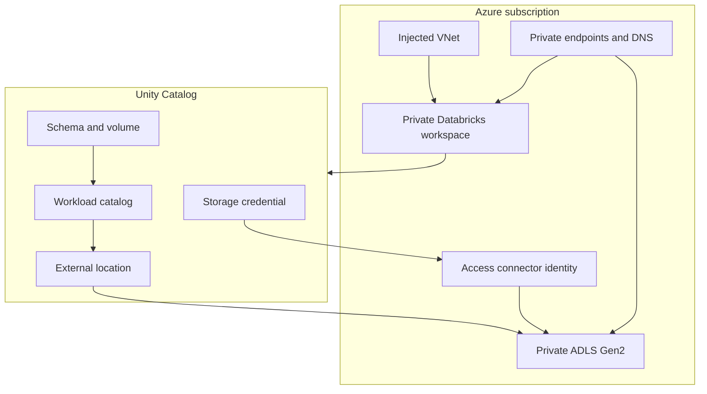

# Architecture

| Plane | Ownership |
|---|---|
| Azure infrastructure | Platform team |
| Databricks account and metastore | Data platform administrators |
| Workload catalog and bundle | Data engineering team |
| Runtime data | Environment-specific job identity |
