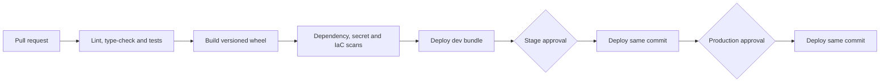

# CI/CD

| Stage | Identity | Mutable input allowed? |
|---|---|---|
| Validate | None | Source commit only |
| Dev deploy | Dev deployment principal | Environment variables |
| Stage deploy | Stage deployment principal | No artifact rebuild |
| Prod deploy | Production deployment principal | No artifact rebuild |

Azure DevOps environment checks provide human approval. The service connection uses workload identity federation and all Databricks commands execute inside `AzureCLI@2`.
