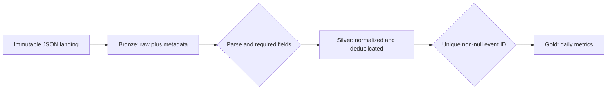

# Medallion Architecture

| Field | Bronze | Silver | Gold |
|---|---|---|---|
| Event key | Source string | Trimmed and unique | Distinct count |
| Event time | String | Timestamp | Event date |
| Metric | Source case | Lowercase | Grouping dimension |
| Region | Source case | Uppercase | Grouping dimension |
| Ingestion metadata | Added | Preserved | Not exposed |
