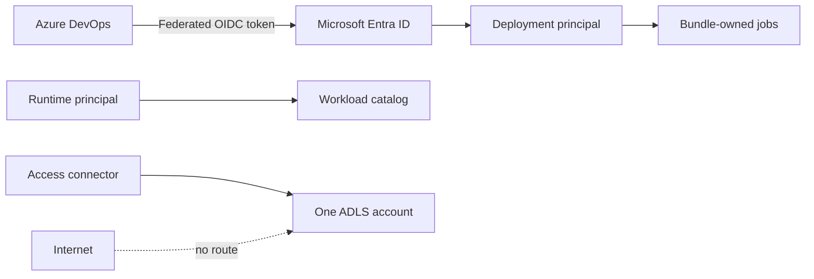

# Security

| Risk | Mitigation |
|---|---|
| Token leakage | Workload identity federation; no personal access token |
| Data exfiltration | Private endpoints, no-public-IP compute and catalog isolation |
| Privilege coupling | Separate deployment, runtime and storage identities |
| Storage firewall | Default deny; only Azure trusted services bypass the rule set |
| Schema drift | Explicit schema and fail-closed quality gate |
| Supply-chain change | Locked dependencies and versioned wheel artifact |
